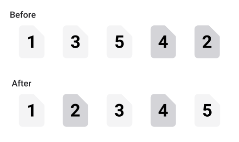

# Rearrange PDF as Duplex Scan

An app to fix the page order of a double-sided PDF scan from a scanner without a duplex feature. It reorders the pages of a PDF from e.g. `(1,3,5,4,2)` to the correct order `(1,2,3,4,5)`.



Try out the app on [pdf-duplex-scan.vercel.app](https://pdf-duplex-scan.vercel.app) with two example PDF files: [Example 1](https://github.com/clemensheithecker/pdf-duplex-scan/raw/main/pdf-examples/pdf-example-1.pdf) and [Example 2](https://github.com/clemensheithecker/pdf-duplex-scan/raw/main/pdf-examples/pdf-example-2.pdf).

## Project highlights

- Drag-and-drop file selection
- Form validation
- Array reordering based on pattern
- User interface for dark and light color schemes
- JavaScript browser validation

## Getting started

Check out the app by running the project locally:

1. Clone this repo

    ```sh
    git clone https://github.com/clemensheithecker/pdf-duplex-scan.git
    cd pdf-duplex-scan
    ```

2. Initialize the project's dependencies

    ```sh
    npm install
    ```

3. Run the development server

    ```sh
    npm run dev
    ```

## App dependencies

The app uses several light-weight dependencies to run:

- *[Vite](https://vitejs.dev)* as a fast development server for vanilla JavaScript
- *[tailwindcss](https://tailwindcss.com)* and its *[@tailwindcss/forms](https://github.com/tailwindlabs/tailwindcss-forms)* plugin for consistent styling directly in the HTML markup
- *[pdf-lib](https://pdf-lib.js.org/)* to create and modify PDF documents
- *[downloadjs](http://danml.com/download.html)* to download files from JavaScript
